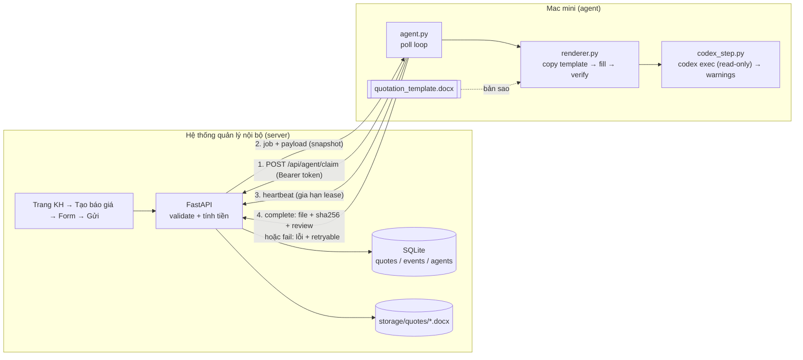
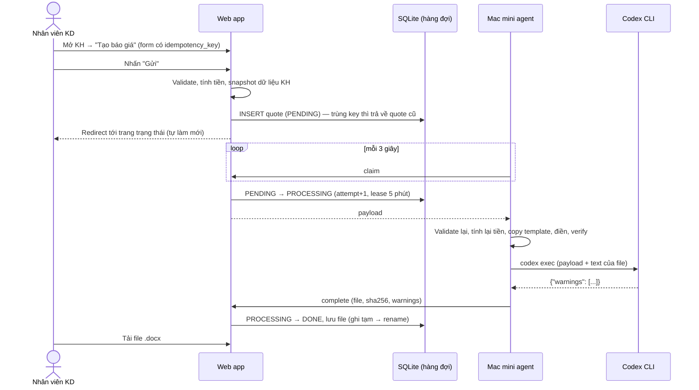

# Solution Plan – Tạo báo giá tự động (Web nội bộ → Mac mini → File báo giá)

## 1. Tóm tắt

- **Web nội bộ** (FastAPI + SQLite) lưu yêu cầu báo giá và là nơi duy nhất quyết định trạng thái: `PENDING → PROCESSING → DONE / FAILED`.
- **Agent trên Mac mini** tự **kéo (pull)** job từ web qua HTTPS. Web không đẩy (push) xuống Mac mini.
- Agent điền dữ liệu vào **bản sao** của template DOCX bằng **code xác định** (docxtpl), kiểm tra file đầu ra rồi upload lại web.
- **Codex CLI** chỉ làm bước **review tư vấn**: đọc báo giá như một người kiểm tra và đưa ra cảnh báo. Codex không tính tiền, không sửa file và không chặn việc giao file.

## 2. Kiến trúc

### Luồng xử lý một báo giá

### Máy trạng thái

| Từ | Sự kiện | Đến |
|---|---|---|
| — | Nhân viên gửi form hợp lệ | `PENDING` |
| `PENDING` | Agent claim | `PROCESSING` (attempts+1, đặt lease) |
| `PROCESSING` | Agent upload file hợp lệ | `DONE` |
| `PROCESSING` | Lỗi tạm thời, vẫn còn lượt thử | `PENDING` |
| `PROCESSING` | Lỗi vĩnh viễn, hoặc đã hết lượt thử | `FAILED` |
| `PROCESSING` | Lease hết hạn (agent chết hoặc mất mạng) | `PENDING`, hoặc `FAILED` nếu đã hết lượt |
| `FAILED` | Nhân viên bấm "Chạy lại" | `PENDING` (cấp thêm lượt thử) |

Mọi chuyển trạng thái được ghi vào `quote_events` và hiển thị thành "Nhật ký xử lý" trên trang báo giá.

## 3. Các quyết định kỹ thuật và lý do

| Quyết định | Lý do | Ảnh hưởng / đánh đổi |
|---|---|---|
| **Pull thay vì push** (điều chỉnh so với sơ đồ gốc, nơi web "gửi" sang Mac mini) | Mac mini nằm sau NAT văn phòng nên không cần mở port. Khi Mac mini offline, job vẫn nằm trong hàng đợi, không mất. Server là nguồn sự thật duy nhất. | Có độ trễ tối đa bằng chu kỳ poll (3 giây). Nếu cần thì chuyển sang long-poll hoặc WebSocket. |
| **Hàng đợi bằng bảng SQLite** thay vì Redis/RabbitMQ | Quy mô SME chỉ vài chục báo giá mỗi ngày, cần ít thành phần để dễ vận hành. `BEGIN IMMEDIATE` bảo đảm một job chỉ được claim một lần. | Khi có nhiều agent hoặc tải lớn thì chuyển sang Postgres (`SELECT … FOR UPDATE SKIP LOCKED`). |
| **Lease + heartbeat + fencing (worker_id + attempt)** | Agent có thể chết giữa chừng. Lease hết hạn thì job tự quay lại hàng đợi. Nếu agent "cũ" quay lại sau đó, kết quả của nó bị từ chối (409), nên không ghi đè được kết quả mới. | Job cực lâu cần heartbeat, và agent đã có luồng heartbeat. |
| **Điền template bằng code (docxtpl), không dùng AI** | Tiền và thông tin khách hàng phải chính xác tuyệt đối, tái lập được và kiểm thử được. LLM không xác định (non-deterministic), có thể "bịa", chậm và tốn phí. | Khi đổi template phải đặt lại placeholder. Codex rất phù hợp để làm việc này ở thời điểm phát triển (xem mục 4). |
| **DOCX làm đầu ra** | Công ty đã có mẫu Word. Nhân viên có thể chỉnh sửa nhỏ trước khi gửi, và DOCX giữ nguyên định dạng mẫu. | Nếu cần file PDF khóa nội dung thì thêm bước `soffice --headless --convert-to pdf` trên Mac mini. |
| **Snapshot dữ liệu KH vào payload** tại thời điểm gửi | Báo giá là chứng từ. Sửa thông tin KH về sau không được làm thay đổi báo giá cũ. | Dữ liệu bị lặp một phần, chấp nhận được. |
| **Tính tiền 2 lần** (server và agent) | Phòng thủ nhiều lớp: nếu payload bị sai hoặc bị sửa, agent từ chối tạo file (lỗi vĩnh viễn). | Hai bên phải dùng chung `common/quote_logic.py`. |

## 4. Vai trò thực sự của Codex CLI

| Công việc | AI hay code? | Vì sao |
|---|---|---|
| Validate dữ liệu, tính thành tiền/VAT/tổng, đọc số thành chữ | **Code** | Phải đúng 100%, có unit test |
| Chọn ô để điền, copy template, xuất file | **Code** (docxtpl) | Xác định, tái lập được |
| Kiểm tra file đầu ra (còn placeholder? thiếu tên hàng, số lượng, tổng tiền?) | **Code** | Kiểm tra cứng, không phụ thuộc AI |
| Trạng thái, retry, idempotency | **Code** | Logic hệ thống |
| **Review báo giá "như người"**: giá lệch nhiều so với giá niêm yết, số lượng nghi thừa số 0, ghi chú mâu thuẫn với điều khoản, lỗi chính tả | **Codex** (`codex exec`, sandbox read-only) | Đây là việc cần đọc hiểu ngữ cảnh, nơi LLM có lợi thế. Kết quả chỉ là **cảnh báo tư vấn**; nếu Codex lỗi hoặc timeout thì fallback về rule-based và file vẫn được giao. |
| **Thời điểm phát triển:** chuyển template Word thật của công ty thành template có placeholder, sinh mapping và test | **Codex** (dùng bởi developer) | Việc làm một lần, có người review. Đây là nơi Codex tiết kiệm nhiều công sức nhất. |

Codex được gọi như sau:
`codex exec --sandbox read-only --skip-git-repo-check --cd <thư mục tạm rỗng> --output-last-message answer.txt -`.
Prompt được truyền qua stdin, output bắt buộc là JSON `{"warnings": [...]}` và được parse, validate trước khi lưu.

## 5. Rủi ro vận hành và cách xử lý

| Tình huống | Cách xử lý (✔ có trong prototype · ◻ thiết kế) |
|---|---|
| Dữ liệu không hợp lệ | ✔ Validate ở server (form hiển thị lỗi tiếng Việt, HTTP 422). ✔ Agent validate lại. ✔ Lỗi dữ liệu là lỗi vĩnh viễn, không retry vô ích. |
| Người dùng gửi nhiều lần (double-click, F5) | ✔ `idempotency_key` (UUID sinh sẵn trong form, UNIQUE trong DB). ✔ POST-Redirect-GET. ✔ Nút gửi bị khóa sau lần bấm đầu. |
| Mac mini mất kết nối | ✔ Job nằm `PENDING` trong hàng đợi. ✔ UI hiển thị trạng thái agent (last seen) và cảnh báo. ✔ Agent tự backoff và reconnect. ✔ Upload được retry với exponential backoff. |
| Tiến trình chết giữa chừng | ✔ Lease hết hạn thì job tự quay lại hàng đợi. ✔ Làm việc trên bản sao trong thư mục tạm, chỉ `os.replace` khi thành công. ✔ Server ghi file tạm rồi mới rename. |
| Cần retry | ✔ Tối đa `MAX_ATTEMPTS` (3) lần tự động, phân biệt lỗi tạm thời và lỗi vĩnh viễn. ✔ Nút "Chạy lại" cho job `FAILED`. ✔ `SIMULATE_FAILURE=1` để demo. |
| File đầu ra sai hoặc hỏng | ✔ Verify: mở được file, không còn `{{ }}`, có đủ số báo giá, tên KH, từng tên hàng, số lượng, thành tiền, tổng, số tiền bằng chữ. ✔ SHA-256 được server kiểm tra khi upload. ✔ Jinja `StrictUndefined`: gõ sai placeholder thì báo lỗi ngay thay vì để trống. |
| Agent cũ gửi kết quả muộn | ✔ Fencing theo `worker_id + attempt`, trả về 409. |
| Codex chậm, lỗi, trả output rác | ✔ Timeout 120 giây, parse JSON chặt, fallback sang mock, không chặn việc giao file. |

## 6. Bảo mật (mức phù hợp hệ thống nội bộ SME)

- **Authentication nhân viên:** đăng nhập bằng mật khẩu băm PBKDF2-SHA256 (200k vòng, có salt). Session token ngẫu nhiên lưu trong cookie `HttpOnly`, `SameSite=Lax`, TTL 8 giờ. Production nên dùng SSO (Google Workspace / Microsoft 365) của công ty.
- **Authorization:** nhân viên KD chỉ thấy khách hàng được phân công và báo giá của mình. Admin thấy tất cả. Truy cập trái phép trả 404 để không lộ sự tồn tại của bản ghi.
- **Authentication agent:** Bearer token dùng chung (so sánh constant-time), tách biệt hoàn toàn khỏi session người dùng. Production: token riêng cho từng Mac mini, có rotate. Kênh truyền nên là HTTPS qua Tailscale/WireGuard hoặc mTLS.
- **Bảo vệ dữ liệu khách hàng:** file chỉ tải được sau khi đã kiểm tra quyền. Codex chạy trong sandbox read-only, thư mục làm việc rỗng. Lưu ý: khi dùng Codex, dữ liệu báo giá được gửi tới OpenAI, nên cần công ty chấp thuận, hoặc mask tên/MST khách hàng trước khi gửi (dễ làm, vì Codex không cần tên thật để review giá). Có thể tắt hẳn bằng `CODEX_MODE=off`.
- **Validation và escaping:** Jinja autoescape trên cả HTML lẫn DOCX XML (đã test với `A&B <x>`). Giới hạn kích thước upload 10MB, số dòng hàng, độ dài ghi chú.
- **Logging và audit:** log có cấu trúc ở cả web và agent. Bảng `quote_events` ghi ai làm gì, lúc nào. Log không in payload đầy đủ, để tránh lộ dữ liệu KH vào log.

## 7. Mock / giả lập trong prototype và cách thay bằng triển khai thật

| Phần | Prototype | Triển khai thật |
|---|---|---|
| Hệ thống quản lý nội bộ | Web FastAPI tự dựng, có KH và sản phẩm giả | Gắn nút "Tạo báo giá" vào hệ thống thật. Hệ thống đó chỉ cần gọi logic tạo quote (hoặc gọi API `POST /customers/{id}/quotes`) và cung cấp API cho agent. |
| Mac mini | Agent chạy cùng máy, `SERVER_URL=http://127.0.0.1:8000` | Copy thư mục `agent/`, `common/`, `templates/` lên Mac mini, đặt `SERVER_URL` là địa chỉ HTTPS nội bộ, chạy dưới dạng `launchd` service (KeepAlive). |
| Codex CLI | `CODEX_MODE=mock`: rule-based, cùng định dạng output | Cài `codex`, đăng nhập một lần, đặt `CODEX_MODE=real`. Code gọi `codex exec` đã có sẵn trong `agent/codex_step.py`. |
| Template | Template giả tạo bằng `scripts/make_template.py` | Template Word thật của công ty, thêm placeholder `{{ ... }}` và ``. |
